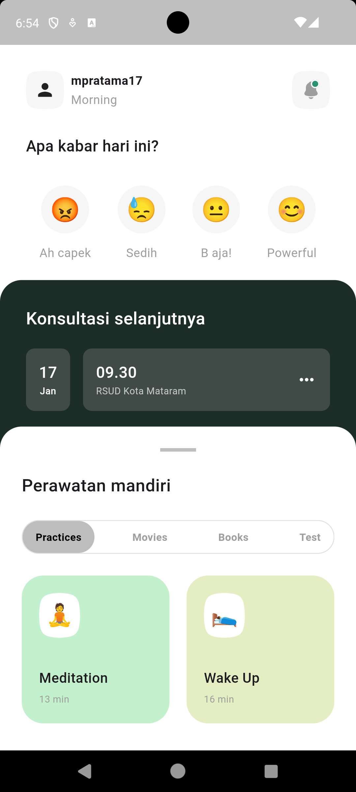

# Self-Care App - UI Slicing

Self-Care App adalah implementasi desain UI dari aplikasi asisten kesehatan mental yang diambil sebagai referensi dari [Dribbble](https://dribbble.com/shots/20960950-Self-care-App-UI). Desain ini berfokus pada tampilan antarmuka untuk membantu pengguna melacak suasana hati dan menyediakan berbagai pilihan untuk perawatan mandiri.

## Deskripsi
Proyek ini adalah implementasi UI hasil slicing dari desain Dribbble. Proyek ini hanya berfokus pada bagian antarmuka pengguna (UI) dan belum memiliki fungsionalitas backend atau logika bisnis. Proyek ini dapat digunakan sebagai dasar atau referensi untuk membangun aplikasi kesehatan mental yang lebih lengkap.

## Desain Asli
Desain UI ini dibuat berdasarkan konsep "Self-care App UI" yang tersedia di Dribbble:
- [Self-care App UI by Dribbble Designer](https://dribbble.com/shots/20960950-Self-care-App-UI)


## Fitur UI yang Telah Diimplementasikan
- **Pelacakan Suasana Hati**: Tampilan ikon untuk mencatat suasana hati pengguna.
- **Jadwal Konsultasi**: Antarmuka untuk menampilkan jadwal konsultasi berikutnya.
- **Perawatan Mandiri**: Bagian untuk memilih kegiatan seperti meditasi dan aktivitas lainnya.
- **Navigasi Sederhana**: Navigasi dasar untuk melihat berbagai pilihan perawatan mandiri.

## Teknologi yang Digunakan
- **Bahasa Pemrograman**: Kotlin/Java
- **Android XML Layouts**: Untuk membuat tampilan UI sesuai dengan desain referensi.
- **Android Studio**: Sebagai lingkungan pengembangan terintegrasi (IDE) untuk membangun dan menjalankan aplikasi.

## Cara Menjalankan Proyek
1. Clone repository ini ke lokal Anda:
    ```bash
    git clone https://github.com/username/self-care-app-ui-slicing.git
    ```
2. Buka proyek dengan **Android Studio**.
3. Jalankan aplikasi di emulator atau perangkat fisik Anda.

## Screenshot
Berikut adalah tampilan antarmuka yang sudah diimplementasikan di emulator:


<!-- Atau menggunakan kode HTML -->


## Pengembangan Lebih Lanjut
Proyek ini hanya berfokus pada sisi UI. Untuk mengembangkan aplikasi ini lebih lanjut, Anda dapat:
- Menambahkan logika dan fungsionalitas seperti pelacakan mood dan integrasi dengan database.
- Mengimplementasikan konektivitas ke layanan backend untuk fitur konsultasi dan sumber daya kesehatan mental.

## Kontribusi
Kontribusi terbuka untuk siapa saja yang ingin mengembangkan proyek ini lebih lanjut, khususnya dalam hal penambahan fungsionalitas. Silakan fork repository ini dan ajukan pull request untuk setiap perubahan yang ingin Anda sumbangkan.

## Kredit
Desain UI ini diadaptasi dari [Self-care App UI](https://dribbble.com/shots/20960950-Self-care-App-UI) yang ada di Dribbble. Terima kasih kepada desainer asli atas inspirasinya.

## Lisensi
Proyek ini dilisensikan di bawah [MIT License](https://opensource.org/licenses/MIT).
